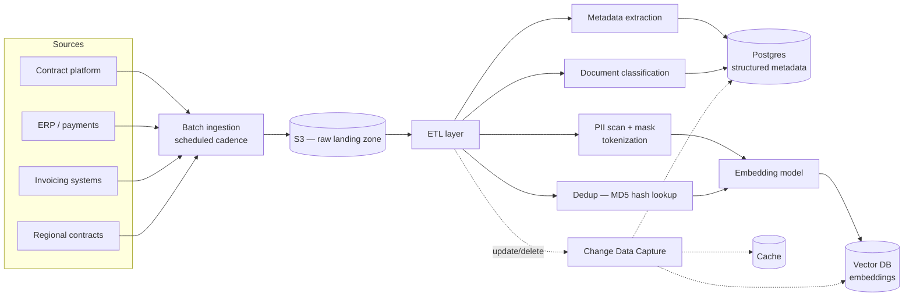
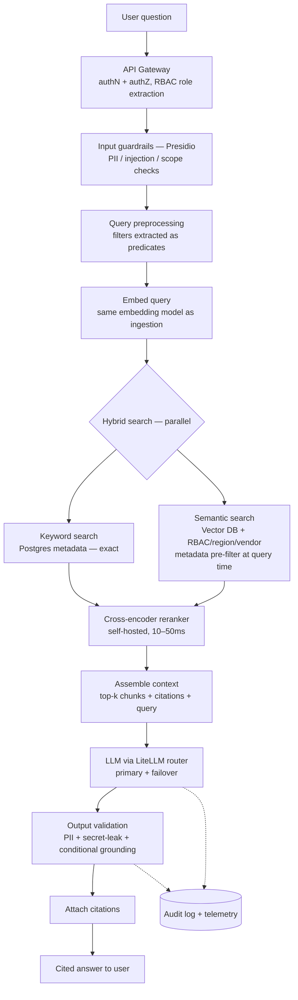

# Contract Intelligence System — Enterprise RAG Agent

> **Role:** Technical Lead / Principal Engineer — owned the architecture and led the team.
> **Type:** Production GenAI system (sanitized public case study). Internal and vendor
> names have been generalized; the architecture and engineering decisions are my own.

A natural-language AI agent that gives procurement and contract-management teams a **single
source of truth** over contract data that was previously fragmented across four enterprise
systems. Users ask plain-English questions and get **accurate, cited answers in seconds**.

> *"What discount does Vendor A offer on electronics?"*
> *"When does our contract with Vendor B expire?"*

---

## 1. The problem

Contract information lived in four disconnected systems:

- A **contract management platform** (master contracts, terms)
- An **ERP** (purchase orders, payments)
- Multiple **invoicing systems**
- **Region-specific contract systems** (e.g. EU) not yet migrated to the main platform

Because of this fragmentation, the contract team had **no single source of truth**. They
missed rebate opportunities, lacked intelligence at the point of purchase-order placement,
struggled to prepare for negotiations, and spent hours manually searching across systems for
basic facts.

**Goal:** one AI agent, natural-language in, cited answer out — accurate, access-controlled,
and reliable enough for enterprise procurement decisions.

---

## 2. Architecture at a glance

Two clearly separated flows: an **ingestion pipeline** (batch) and a **query pipeline** (real time).

### 2.1 Ingestion pipeline

**ETL sequence, per document:**

1. **Metadata extraction** — structured fields (vendor ID, contract ID, type, region, dates, amounts) → Postgres.
2. **PII scan + masking** — detect PII, apply tokenization/masking *before* anything reaches embeddings or LLM context. No sensitive data leaks downstream.
3. **Classification** — PO / invoice / master contract / amendment. Stored as metadata, used later for filtering.
4. **Deduplication** — MD5 content hash against a Postgres lookup table. Same hash → skip. Same ID + different hash → content changed → invalidate old version (delete stale embeddings, refresh metadata).
5. **Change Data Capture** — updates/deletes in source systems propagate through ETL and keep the vector DB, metadata store, and cache in sync. Deletions remove embeddings and archive metadata for audit.

### 2.2 Query pipeline

---

## 3. Query pipeline — component by component

**API gateway (authN/authZ).** Establishes user identity and extracts role/group membership for **RBAC filtering** applied downstream.

**Input guardrails (Microsoft Presidio).** On the *incoming query only*: PII detection (don't embed pasted-in sensitive data), prompt-injection / scope checks. Cheap and early.

**Query preprocessing.** Structured filters (vendor, region, document type) are pulled out as **filter predicates** rather than left in the embedded text — they go to both Postgres and the vector DB as filters, which is more precise than hoping semantics capture them.

**Query embedding.** Same embedding model used at ingestion, so queries and documents share one vector space — embedding-space consistency.

**Hybrid search (parallel, not sequential).** Sequential would add latency for no benefit.
- **Keyword (Postgres):** exact matches on structured metadata — fast, zero false positives on IDs/regions.
- **Semantic (vector DB):** vector similarity with **metadata pre-filtering at query time** — RBAC group, region, and vendor are passed as filter predicates so the index only returns authorized documents. Filtering at query time is more efficient and more secure than retrieving everything and filtering client-side. Catches meaning: *"rebate on electronics"* matches *"discount on tech products."*

**Reranking (self-hosted cross-encoder).** Merged results are reranked by a cross-encoder rather than a paid reranking API — 10–50ms, no per-call cost, full control.

**Context assembly.** Top-k chunks + their source metadata (for citation) + original query, kept within the model's context window with headroom for the response.

**LLM generation (via LiteLLM router).** A router abstracts the provider and manages failover (see §5). Models were evaluated against an internal eval set; quality was comparable across providers with prompt templates tuned per model.

**Output validation.** Before the user sees anything: PII re-check on the response, secret/internal-info leak check, and **conditional context-grounding** — a cosine-similarity hallucination check that runs *only* when reranker confidence was below 95%, saving 200–400ms on high-confidence answers.

**Citations.** Every answer carries document path + source system + link, so users can verify each claim — the final human-in-the-loop check.

**Audit logging & telemetry.** Every cycle logs query, user, retrieved docs + rerank scores, model used, tokens, latency, grounding result. Feeds dashboards and weekly data-quality reviews.

---

## 4. Caching

- **Population:** most-frequently-queried vendor/contract combinations, by query-frequency metrics.
- **TTL:** ~4 weeks — contract data changes slowly.
- **Invalidation:** immediate on MD5 hash change (content update) or deletion flag — not waiting for TTL.
- **Fallback role:** if the vector DB is unavailable, serve from cache; on a miss, return a graceful "system unavailable" message with a human contact path.

---

## 5. Resiliency & failure modes

| Failure | Handling |
|---|---|
| **Vector DB down** | Serve from cache → graceful degradation message with human contact |
| **LLM model issue** | LiteLLM failover: primary → same-provider lower tier |
| **Provider-wide outage** | LiteLLM failover: cross-provider model |
| **Rate-limited everywhere** | Serve from cache, else queue with expected wait |
| **Silent doc corruption** | MD5 mismatch flags it; weekly reconciliation across store/index/metadata; re-ingest affected docs |
| **Source deletion** | Deletion flag → remove embeddings, archive metadata (audit), invalidate cache |

---

## 6. Scaling

- **Compute:** multiple Kubernetes clusters serve the API pipeline; horizontal pod scaling for load.
- **Postgres:** one write primary + read replicas for concurrent query load; shard on user ID if write load grows.
- **Vector DB:** managed service auto-scales.
- **10× growth path:** more pods, more read replicas, managed-index scaling.

---

## 7. Key trade-offs (decided deliberately)

| Decision | Choice | Why | Trade-off accepted |
|---|---|---|---|
| Vector DB | Managed service | No ops overhead, auto-scale, query-time metadata filtering | Vendor lock-in, cost at scale |
| Embedding model | One model for docs + queries | Shared vector space, strong domain perf | API dependency |
| Reranker | Self-hosted cross-encoder | No API cost, 10–50ms latency | Manage infra; slightly below best-in-class API |
| LLM | Primary via LiteLLM | Best accuracy; router enables failover | Cost, API dependency |
| Grounding checks | Conditional (<95% confidence only) | Saves 200–400ms on confident answers | ~1% residual risk, mitigated by citations |
| Cache TTL | ~4 weeks | Contract data is stable | Staleness risk, mitigated by hash invalidation |
| Search | Hybrid parallel | Exact + semantic recall | More complex than single-strategy |
| Guardrails | Microsoft Presidio | Strong PII detection, open-source | Requires maintenance |

---

## 8. What I'd revisit

- Move from **batch ingestion to real-time CDC** for fresher data.
- **Automated grounding for all responses** (not only low-confidence) once latency budget allows — closing the ~1% high-confidence gap.
- Push **parallel search** even earlier in the design cycle.
- Add an **automated fact-checking** layer to complement citation-based human verification.

---

## 9. My role

I **led** this system end to end: architecture, the ingestion/query split, the hybrid-search and reranking strategy, the guardrail and grounding design, the failover model, and the team delivering it.

`RAG` · `hybrid retrieval` · `cross-encoder reranking` · `Postgres` · `vector DB` · `LiteLLM` · `Presidio` · `Kubernetes` · `Python`
