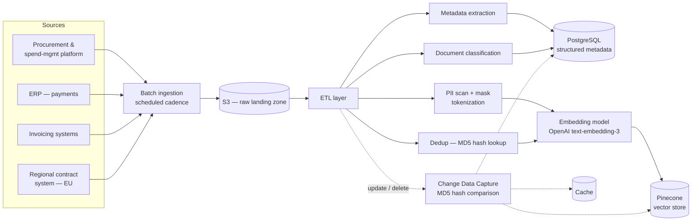
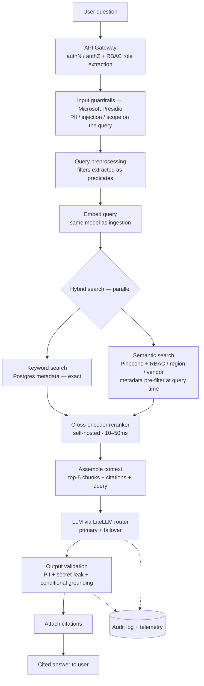

# 🔍 Contract Intelligence System — Enterprise RAG Agent

> A natural-language AI agent that gives procurement and contract-management teams a **single
> source of truth** over contract data previously fragmented across four enterprise systems.
> Plain-English question in → **accurate, access-controlled, cited answer** out, in seconds.
>
> *Sanitized case study. Internal business-system names are generalized; the architecture and
> engineering decisions are my own.*

[← Back to profile](./README.md)

---

## Contents

- [1. The problem](#1-the-problem)
- [2. Architecture overview](#2-architecture-overview)
- [3. Ingestion pipeline](#3-ingestion-pipeline)
- [4. Query pipeline](#4-query-pipeline)
- [5. Caching](#5-caching)
- [6. Resiliency & failure modes](#6-resiliency--failure-modes)
- [7. Scaling](#7-scaling)
- [8. Key trade-offs](#8-key-trade-offs)
- [9. Design FAQ](#9-design-faq)
- [10. What I'd revisit](#10-what-id-revisit)
- [My role](#my-role)

---

## 1. The problem

Contract information lived in four disconnected systems:

- An **enterprise procurement & spend-management platform** — master contracts and terms
- An **ERP system** — purchase orders and payments
- Multiple **invoicing systems** — invoices
- A **regional contract system (EU)** — contracts for regions not yet migrated to the main platform

Because of this fragmentation, the contract team had **no single source of truth**. They missed
rebate opportunities, lacked intelligence at the point of purchase-order placement, struggled to
prepare for negotiations, and spent hours manually searching across systems for basic facts.

**Goal:** one AI agent — natural-language in, cited answer out — accurate, access-controlled, and
reliable enough for enterprise procurement decisions. Example questions:

> *"What discount does Vendor A offer on electronics?"*
> *"When does our contract with Vendor B expire?"*

---

## 2. Architecture overview

Two clearly separated flows: a **batch ingestion pipeline** and a real-time **query pipeline**.
Keeping them separate is a deliberate design choice — ingestion is throughput-oriented and can be
reprocessed; the query path is latency-oriented and user-facing.

---

## 3. Ingestion pipeline

Data is pulled from the four source systems on a scheduled cadence and lands as raw documents in
an **S3 raw landing zone**. From there the **ETL layer** processes each document through a defined
sequence:

1. **Metadata extraction** — structured fields (vendor ID, contract ID, contract type, region,
   dates, amounts) are extracted and stored in **PostgreSQL** as the structured metadata store.
2. **PII scan + masking** — documents are scanned for personally identifiable information; where
   PII is found, tokenization and masking are applied **before** anything moves further. No
   sensitive data leaks into embeddings or LLM context.
3. **Classification** — each document is classified (purchase order / invoice / master contract /
   amendment). The class is stored as metadata and used later for retrieval filtering.
4. **Deduplication** — an MD5 content hash is computed and checked against a Postgres hash-lookup
   table. Same hash → skip reprocessing. Same document ID with a **different** hash → content
   changed → invalidate the old version (delete stale embeddings from Pinecone, refresh metadata).
5. **Change Data Capture** — updates and deletions in source systems propagate through the ETL
   layer. Changes are detected via MD5 hash comparison; deletions flow through and remove the
   embeddings from Pinecone, metadata from Postgres, and entries from cache — keeping the vector
   store continuously in sync with the systems of record.

> **Note on MD5:** used purely for content comparison and deduplication — not as a security
> primitive.

---

## 4. Query pipeline

**4.1 — API gateway (authN/authZ).** The query hits the gateway, where authentication and
authorization happen. User identity is established and role/group membership is extracted for
**RBAC filtering** applied downstream.

**4.2 — Input guardrails (Microsoft Presidio).** On the *incoming query only*: PII detection (so a
user accidentally pasting sensitive data doesn't get it embedded), prompt-injection and scope
checks. Cheap and early.

**4.3 — Query preprocessing.** Structured filters (vendor, region, document type) are pulled out
and passed as **filter predicates** to both Postgres and Pinecone, rather than left inside the
embedded query text — this is more precise than hoping the embedding captures them.

**4.4 — Query embedding.** The clean query is embedded with the **same OpenAI `text-embedding-3`
model used at ingestion**, so queries and documents share one vector space — embedding-space
consistency.

**4.5 — Hybrid search (parallel, not sequential).** Sequential execution would add latency for no
benefit, so keyword and semantic search run in parallel:

- **Keyword (Postgres):** exact matches against structured metadata — vendor ID, contract ID,
  document type, region. Fast, precise, zero false positives on structured data.
- **Semantic (Pinecone):** vector similarity with **metadata pre-filtering at query time** — RBAC
  group, region, and vendor are passed as filter predicates directly in the Pinecone query, so the
  index only returns documents the user is authorized to see. Filtering at query time is more
  efficient *and* more secure than retrieving everything and filtering client-side. Semantic search
  catches meaning: *"rebate on electronics"* matches *"discount on tech products"* even when the
  exact words don't overlap.

**4.6 — Reranking (self-hosted cross-encoder).** Results from both searches are merged and passed
to a **cross-encoder reranker** rather than a paid reranking API — 10–50ms, no per-call cost, and
full control over the model.

**4.7 — Context assembly.** The top-5 chunks with their source metadata (document path, vendor,
contract ID for citation) plus the original query are assembled, keeping total token count (system
+ context + query) within the model's limit with room for the response.

**4.8 — LLM generation (via LiteLLM router).** The prompt goes to the primary model (GPT-4.5), with
**LiteLLM** providing provider abstraction and failover. Models were evaluated against an internal
eval set; quality was comparable across providers, with prompt templates tuned per model.

**4.9 — Output validation.** Before the response reaches the user:

- **PII check on the response** — scan the output for any PII that leaked through; mask if found.
- **Security check** — verify no sensitive internal information (keys, internal URLs, system
  prompts) is exposed.
- **Conditional context grounding** — a cosine-similarity hallucination check that runs **only when
  reranker confidence was below 95%**, saving 200–400ms on high-confidence answers.

**4.10 — Citations.** Every answer carries document path, source system, and a direct link, so
users can click through and verify each claim against the original document — the final
human-in-the-loop validation layer.

**4.11 — Audit logging & telemetry.** Every query→response cycle logs the query, user ID,
timestamp, retrieved documents and rerank scores, model used, token count, latency, and grounding
result. This feeds monitoring dashboards and weekly data-quality reviews.

---

## 5. Caching

- **Population:** the most-frequently-queried vendor/contract combinations, by query-frequency
  metrics.
- **TTL:** ~4 weeks — contract data changes slowly, so this is acceptable.
- **Invalidation:** immediate on MD5 hash change (content update) or a deletion flag — not waiting
  for TTL expiry.
- **Fallback role:** if Pinecone is unavailable, serve from cache; on a miss, return a graceful
  "system unavailable" message with a human contact path for manual lookup.

---

## 6. Resiliency & failure modes

| Failure | Handling |
|---|---|
| **Vector store unavailable** | Serve from cache → graceful degradation message with human contact |
| **LLM model issue** | LiteLLM failover: primary → same-provider lower tier (GPT-4.5 → GPT-4o) |
| **Provider-wide outage** | LiteLLM failover: cross-provider model (→ Claude) |
| **Rate-limited everywhere** | Serve from cache; else queue the request with an expected wait time |
| **Silent document corruption** | MD5 mismatch flags it → weekly reconciliation across store/index/metadata → re-ingest affected docs |
| **Source document deletion** | Deletion flag → remove embeddings, archive metadata for audit, invalidate cache |

---

## 7. Scaling

- **Compute:** multiple Kubernetes clusters serve the API pipeline; horizontal pod scaling absorbs load.
- **Postgres:** one write primary + read replicas for concurrent query load; shard on user ID if write load grows.
- **Vector store:** managed service auto-scales.
- **10× growth path:** more pods, more read replicas, and managed-index scaling.

---

## 8. Key trade-offs

Every component was a deliberate decision with an accepted cost:

| Decision | Choice | Why | Trade-off accepted |
|---|---|---|---|
| Vector store | Pinecone (managed) | No ops overhead, auto-scale, query-time metadata filtering | Vendor lock-in, cost at scale |
| Embedding model | One model for docs + queries | Shared vector space, strong domain performance | API dependency |
| Reranker | Self-hosted cross-encoder | No API cost, 10–50ms latency | Manage infra; slightly below best-in-class API |
| LLM | GPT-4.5 via LiteLLM | Best accuracy; router enables failover | Cost, API dependency |
| Grounding checks | Conditional (<95% confidence only) | Saves 200–400ms on confident answers | ~1% residual risk, mitigated by citations |
| Cache TTL | ~4 weeks | Contract data is stable | Staleness risk, mitigated by hash invalidation |
| Search strategy | Hybrid parallel | Exact + semantic recall | More complex than single-strategy |
| Guardrails | Microsoft Presidio | Strong PII detection, open-source | Requires maintenance |

---

## 9. Design FAQ

<b>How do you keep the vector store in sync with the source systems?</b>

Change Data Capture in the ETL layer. Content changes are detected via MD5 hash comparison — a
differing hash means a new version, which invalidates old embeddings. Deletion flags propagate
through ETL and remove embeddings, archive metadata (for audit), and invalidate cache. A weekly
reconciliation job compares S3, Pinecone, and Postgres to catch silent drift.

<b>Why filter at query time instead of after retrieval?</b>

RBAC group, region, and vendor are passed as filter predicates directly into the Pinecone query, so
the index only ever returns authorized documents. Post-retrieval filtering would pull unauthorized
documents into memory first (a security smell) and waste retrieval budget. Query-time filtering is
both more secure and more efficient.

<b>Why a self-hosted cross-encoder reranker instead of a reranking API?</b>

Cost and latency. The self-hosted cross-encoder adds only 10–50ms and incurs no per-call API cost,
which matters at query volume. The trade-off is owning the infrastructure and accepting accuracy
slightly below a best-in-class hosted reranker — acceptable given the latency and cost wins.

<b>Why run grounding checks conditionally?</b>

A full cosine-similarity grounding check on every response adds 200–400ms. Since reranker confidence
is a strong proxy for answer reliability, grounding runs only when confidence is below 95%. This
keeps high-confidence answers fast while still catching the risky tail. The residual ~1% risk on
high-confidence answers is mitigated by always-on citations for human verification.

<b>How is the system evaluated?</b>

An internal evaluation dataset is used to compare models (primary vs failover) and tune prompts per
model, with precision/recall on retrieval and human feedback loops on answer quality. Per-query
telemetry (rerank scores, grounding results, latency, tokens) feeds weekly data-quality reviews.

<b>How are multi-turn conversations handled?</b>

Conversation history is managed within the context window alongside the retrieved context and the
current query, within the model's token budget.

---

## 10. What I'd revisit

- Move from **batch ingestion to real-time CDC** for fresher data.
- Run **automated grounding on all responses** (not only low-confidence) once the latency budget
  allows — closing the ~1% high-confidence gap.
- Introduce **parallel search even earlier** in the design cycle.
- Add an **automated fact-checking** layer to complement citation-based human verification.

---

## My role

I **led** this system end to end: the architecture, the ingestion/query split, the hybrid-search
and reranking strategy, the guardrail and conditional-grounding design, the failover model, and the
team that delivered it.

**Stack:** `RAG` · `hybrid retrieval` · `cross-encoder reranking` · `PostgreSQL` · `Pinecone` ·
`OpenAI embeddings` · `GPT-4.5 / GPT-4o / Claude` · `LiteLLM` · `Microsoft Presidio` · `S3` ·
`Kubernetes` · `Python`

[← Back to profile](./README.md)
