# AI-Powered Invoice Extraction — Document Intelligence

> **Role:** Technical Lead / Principal Engineer — owned the solution and led delivery.
> **Type:** Production GenAI system (sanitized public case study). Internal app and vendor
> API names generalized; architecture and decisions are my own.

An OCR + LLM pipeline that **auto-populates invoice fields** in an internal invoicing
application, replacing slow, error-prone manual data entry. Because vendors use wildly
different invoice formats, LLMs — not brittle regex — handle the variety.

---

## 1. The problem

Manual entry of invoice metadata into the payment-request workflow was slow and mistake-prone:

- ~**30% of monthly payment-request-form (PRF) rejections** came from data mismatches.
- Rejections caused **payment delays and vendor escalations**.
- The team needed automation that improved **both accuracy and speed**.

---

## 2. Why AI instead of traditional OCR

- Vendors use varied invoice formats and inconsistent field labels.
- Plain OCR extracts text but **can't reliably identify which value is which field** using regex.
- An LLM **understands context** and extracts structured data even from formats it hasn't seen before.

The pipeline therefore pairs OCR (read the pixels) with an LLM (interpret the fields).

---

## 3. Architecture

```mermaid
flowchart TB
    subgraph Phase1[Phase 1 — Inline auto-fill]
        U1[User uploads invoice<br/>PDF / image] --> EX1[Extraction API<br/>OCR + LLM]
        EX1 --> F1[Structured fields:<br/>invoice no, date, amount, PO date]
        F1 --> FORM[Auto-fill PRF form]
        FORM --> V1[User verifies & submits]
    end
    subgraph Phase2[Phase 2 — Email-based draft]
        MBX[Shared mailbox] --> JOB[Background job<br/>monitors inbox]
        JOB --> AT[Extract invoice attachment]
        AT --> EX2[Extraction API<br/>OCR + LLM]
        EX2 --> DRAFT[Create draft PRF]
        DRAFT --> NOTIFY[Notify invoicing team for review]
    end
```

### Phase 1 — Inline PRF auto-fill
1. User uploads an invoice PDF/image in the app.
2. File goes to the extraction API (OCR + LLM).
3. API returns structured fields: invoice number, date, amount, PO date.
4. Fields are auto-filled into the PRF form **for human verification** before submit.

### Phase 2 — Email-based draft PRF
1. A background job monitors a shared mailbox.
2. It extracts the invoice attachment and sends it to the extraction API.
3. A **draft PRF** is created in the invoicing app.
4. A notification email routes it to the invoicing team for review.

Both phases keep a **human in the loop** — the AI accelerates, the human approves.

---

## 4. Functional highlights

- PRF auto-fill from an uploaded invoice
- Draft PRF creation from inbound email
- Invoicing-team review workflow built in
- Model handles diverse vendor formats without per-vendor rules
- Improves both processing speed and data accuracy

---

## 5. Success metrics (targets)

| Metric | Target |
|---|---|
| Auto-fill accuracy | ≥ 90% |
| Reduction in PRF creation time | ≥ 60% |
| Drop in rejections | ≥ 50% |
| Draft PRFs created from email | ≥ 30% |

> These were the program's success criteria. Replace with measured production numbers
> once you're cleared to share them — a real number here is worth a lot in interviews.

---

## 6. Design decisions & trade-offs

| Decision | Choice | Why |
|---|---|---|
| Extraction approach | OCR + LLM (not regex) | Generalizes across unseen vendor formats |
| Human review | Always-on, both phases | Invoice errors are costly; keep approval with humans |
| Two entry points | Upload + mailbox | Meets users where they already work |
| Output | Structured fields into existing PRF form | Drops into the current workflow, no retraining users |

---

## 7. My role

I **led** the design and delivery: the OCR+LLM extraction approach, the two-phase rollout
(inline auto-fill, then email-driven drafts), the human-in-the-loop review workflow, and the
success-metric framework.

`OCR` · `LLM extraction` · `document AI` · `human-in-the-loop` · `email automation` · `Python`
