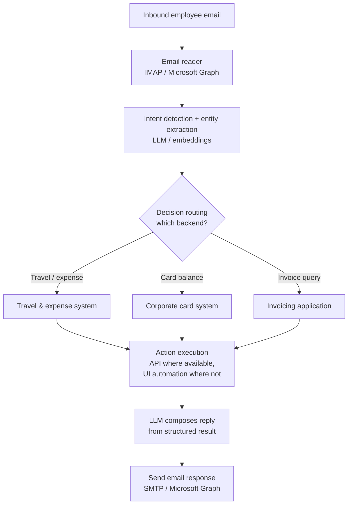

# 🤖 Solution Center Automation — Multi-System Agent

> An **autonomous automation agent** that handles employee service requests end to end: it reads
> inbound email, detects intent, routes to the right backend system, executes the action (via API
> or UI automation), and replies with a professional, generated response — no human in the middle
> for routine requests.
>
> *Sanitized case study. Internal business-system names are generalized; the architecture and
> engineering decisions are my own.*

[← Back to profile](./README.md)

---

## Contents

- [1. The problem](#1-the-problem)
- [2. Architecture](#2-architecture)
- [3. The four stages](#3-the-four-stages)
- [4. Security & access](#4-security--access)
- [5. Build approach & trade-offs](#5-build-approach--trade-offs)
- [6. Why this is an agentic system](#6-why-this-is-an-agentic-system)
- [7. Design FAQ](#7-design-faq)
- [My role](#my-role)

---

## 1. The problem

Employees email a shared service desk for routine operational tasks — travel/expense requests,
corporate-card balance lookups, invoice queries. Each request meant a human reading the mail,
logging into the right system, fetching or submitting data, and writing a reply. Slow, repetitive,
and a poor use of the team's time.

**Goal:** an agent that absorbs the routine end to end and escalates only the exceptions.

---

## 2. Architecture

The agent runs a four-stage loop: **read → understand → act → respond.**

---

## 3. The four stages

### Stage 1 — Email reading & intent detection
Read inbound mail (IMAP or Microsoft Graph). An LLM (or embedding model) **detects intent** (e.g.
"get card balance") and **extracts entities** (user, request date, card/reference IDs).

### Stage 2 — Decision routing
A routing layer maps intent → target backend (travel & expense, corporate card, invoicing).
Implemented as embedding/keyword classification plus LLM function-calling for ambiguous cases, with
a stored intent→system mapping.

### Stage 3 — Action execution across systems
The agent logs into the relevant system and performs the action:
- **Preferred — APIs:** OAuth2 / token auth, REST calls (`requests` / `httpx`). Scalable and robust.
- **Fallback — UI automation:** where only a web UI exists, headless browser automation (Playwright)
  logs in, navigates, reads data, and submits forms.

### Stage 4 — Response generation & reply
An LLM turns the structured result into a natural, professional email, sent back via SMTP / Graph.

---

## 4. Security & access

Acting inside real enterprise systems demands careful access design — built in, not bolted on:
- **Service accounts / delegated access** rather than personal credentials.
- **Proper auth** — OAuth2 tokens or SSO integration.
- **Secrets management** — credentials in a vault (e.g. Azure Key Vault / AWS Secrets Manager),
  never in code.
- Prefer **headless, auditable** automation paths.

---

## 5. Build approach & trade-offs

| Decision | Choice | Why | Trade-off |
|---|---|---|---|
| Intent / entity | LLM + embeddings | Handles free-form email language | Needs eval + guardrails |
| Routing | Classifier + LLM function-calling | Fast for common cases, flexible for ambiguous | Two code paths |
| Action layer | API-first, UI-automation fallback | APIs scale; UI automation unlocks systems without APIs | UI automation is more brittle |
| Reply | LLM-generated from structured data | Natural, consistent tone | Must validate before send |
| Access | Service accounts + vaulted secrets + SSO | Security and auditability | More setup than personal creds |

---

## 6. Why this is an agentic system

It's not a single prompt — it's a multi-step agent that **perceives** (reads mail), **decides**
(intent + routing), **acts with tools** (APIs and browser automation across three systems), and
**communicates** (composes and sends a reply), with guardrails and secure delegated access
throughout. That perceive → decide → act → communicate loop is the core of agentic design.

---

## 7. Design FAQ

<b>How does the agent act in systems that have no API?</b>

API-first, with headless browser automation (Playwright) as a fallback for UI-only systems — it logs
in via a service account, navigates, reads data, and submits forms. APIs are preferred wherever
available because UI automation is more brittle and harder to maintain.

<b>How are credentials kept safe when the agent logs into real systems?</b>

Service accounts / delegated access, OAuth2 tokens or SSO, and secrets stored in a managed vault —
never in code. Automation runs headless and auditable.

<b>What stops a misclassified request from taking the wrong action?</b>

Routing combines fast classification with LLM function-calling for ambiguous cases, and the reply is
validated before sending. Exceptions and low-confidence requests are escalated to a human rather
than actioned blindly.

---

## My role

I **designed and led** this agent: the four-stage architecture, the routing strategy, the API-first
/ UI-automation-fallback execution model, and the secure-access design.

**Stack:** `agents` · `intent detection` · `tool-use / routing` · `LLM function-calling` ·
`LangChain` · `Playwright` · `Microsoft Graph` · `OAuth2` · `Python`

[← Back to profile](./README.md)
