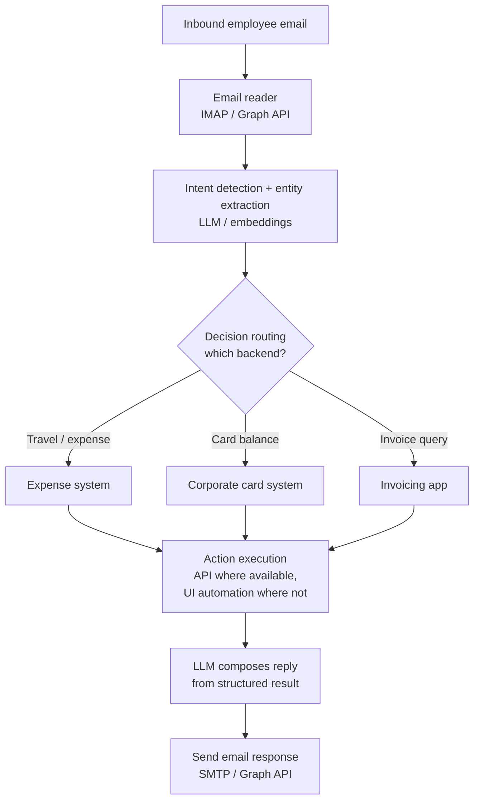

# Solution Center Automation — Multi-System Agent

> **Role:** Technical Lead / Principal Engineer — designed the agent and led delivery.
> **Type:** Production GenAI system (sanitized public case study). Internal system names
> generalized; architecture and decisions are my own.

An **autonomous automation agent** that handles employee service requests end to end: it reads
inbound email, detects intent, routes to the right backend system, executes the action (via API
or UI automation), and replies with a professional, generated response — no human in the middle
for routine requests.

---

## 1. The problem

Employees email a shared service desk for routine operational tasks — travel/expense requests,
corporate-card balance lookups, invoice queries. Each request meant a human reading the mail,
logging into the right system, fetching or submitting data, and writing a reply. Slow, repetitive,
and a poor use of the team's time.

**Goal:** an agent that absorbs the routine end to end and escalates only the exceptions.

---

## 2. Architecture

The agent has four stages: **read → understand → act → respond.**

### Stage 1 — Email reading & intent detection
Read inbound mail (IMAP or Microsoft Graph). An LLM (or embedding model) **detects intent**
(e.g. "get card balance") and **extracts entities** (user, request date, card/reference IDs).

### Stage 2 — Decision routing
A routing layer maps intent → target backend (expense, corporate card, invoicing). Implemented
as embedding/keyword classification plus LLM function-calling for ambiguous cases, with a stored
intent→system mapping.

### Stage 3 — Action execution across systems
The agent logs into the relevant system and performs the action:
- **Preferred — APIs:** OAuth2/token auth, REST calls (`requests`/`httpx`). Scalable and robust.
- **Fallback — UI automation:** where only a web UI exists, headless browser automation
  (Playwright) logs in, navigates, reads data, and submits forms.

### Stage 4 — Response generation & reply
An LLM turns the structured result into a natural, professional email, sent back via SMTP/Graph.

---

## 3. Security & access (designed in, not bolted on)

Acting inside real enterprise systems demands careful access design:
- **Service accounts / delegated access** rather than personal credentials.
- **Proper auth** — OAuth2 tokens or SSO integration.
- **Secrets management** — credentials in a vault (e.g. Azure Key Vault / AWS Secrets Manager),
  never in code.
- Prefer **headless, auditable** automation paths.

---

## 4. Build approach & trade-offs

| Decision | Choice | Why | Trade-off |
|---|---|---|---|
| Intent/entity | LLM + embeddings | Handles free-form email language | Needs eval + guardrails |
| Routing | Classifier + LLM function-calling | Fast for common cases, flexible for ambiguous | Two code paths |
| Action layer | API-first, UI-automation fallback | APIs scale; UI automation unlocks systems without APIs | UI automation is more brittle |
| Reply | LLM-generated from structured data | Natural, consistent tone | Must validate before send |
| Access | Service accounts + vaulted secrets + SSO | Security and auditability | More setup than personal creds |

---

## 5. Why this is an *agentic* system

It's not a single prompt — it's a multi-step agent that **perceives** (reads mail), **decides**
(intent + routing), **acts with tools** (APIs / browser automation across three systems), and
**communicates** (composes and sends a reply), with guardrails and secure delegated access
throughout. That perceive→decide→act→communicate loop is the core of agentic design.

---

## 6. My role

I **designed and led** this agent: the four-stage architecture, the routing strategy, the
API-first / UI-automation-fallback execution model, and the secure-access design.

`agents` · `intent detection` · `tool-use / routing` · `LLM function-calling` · `Playwright` · `Microsoft Graph` · `OAuth2` · `Python`
